Android Integration guide
=========================

Installing the MoEngage library - Eclipse
-----------------------------------------

Step 1 - Get the latest MoEngage library release
^^^^^^^^^^^^^^^^^^^^^^^^^^^^^^^^^^^^^^^^^^^^^^^^^

You must have received the latest MoEngage SDK from the team. If you have received the SDK, please proceed to the next steps.

Step 2 - Import the SDK into your project's workspace
^^^^^^^^^^^^^^^^^^^^^^^^^^^^^^^^^^^^^^^^^^^^^^^^^^^^^^

Add the given MoEngage-Android-SDK.jar file to the project, by copying the jar file to the libs folder. If there is no libs folder please
create a libs folder.

*Make sure that you have the latest android support jar file (android-support-v4.jar) accessable to the project.*

Step 3 - Add permissions to your AndroidManifest.xml
^^^^^^^^^^^^^^^^^^^^^^^^^^^^^^^^^^^^^^^^^^^^^^^^^^^^

In order for the library to work, you need to ensure that you're requesting the following permissions in your AndroidManifest.xml:

::

    <!--
    This permission is required to allow the application to send
    user events and attributes to MoEngage.
    -->
    <uses-permission
      android:name="android.permission.INTERNET" />
    
    <!--
      This permission is optional but recommended so we can be smart
      about when to send data.
     -->
    <uses-permission
      android:name="android.permission.ACCESS_NETWORK_STATE" />

At this point, you're ready to use the MoEngage SDK inside Eclipse!

Setting up Push Notifications through GCM
----------------------------------------

This covers a quick-start guide for setting up push for your Android app that covers setting up your Google API project,
locating the your project number, uploading your Google API Project key to MoEngage portal.

Step 1 - Enabling Google Cloud Messaging (GCM) in your Google API Console
^^^^^^^^^^^^^^^^^^^^^^^^^^^^^^^^^^^^^^^^^^^^^^^^^^^^^^^^^^^^^^^^^^^^^^^^^

To enable Google Cloud Messaging (GCM) for Android, there are a few steps needed.
You will first need to turn on the Google Cloud Messaging Services from `Google's API Console page`_.
If you do you not have a Google API project yet, the following pop up will appear prompting you to create a project.

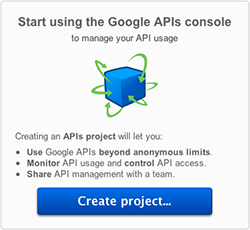

Click on the "Create Project..." to create a new project. Once you have created a new project (or if you already have an existing project),
you will be taken to the console's dashboard.

Once the project has been created, a page appears that displays your project ID and project number. The project number will be your
twelve digit GCM Sender ID, which you will need to use in your code later to register your application for push notifications.

From the Google API Console page, select "Services" from the left-hand navigation. Find "Google Cloud Messaging for Android" in the list of services,
and turn it on by clicking the switch in the "Status" column.

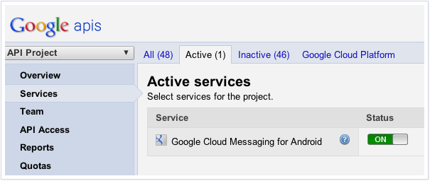

Create an Google API key. From the Google API Console page, select "Public API Access" from the left navigation and click "Create new Server key...". You should see the following pop up.

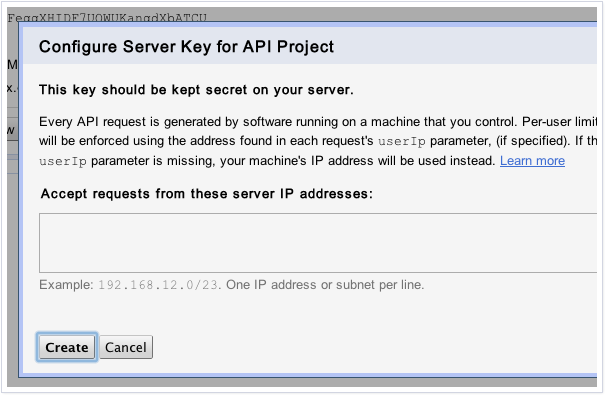

Click the create button. The next page will contain a "Simple API Access" header, and below the header a "Key for server apps" box.
Your Google API key will appear in this box, after the heading "API Key:".

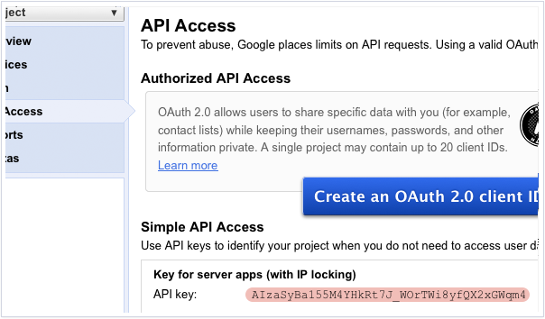

.. _Google's API Console page: https://cloud.google.com/console

Step 2 - Uploading your GCM API Key through MoEngage portal
^^^^^^^^^^^^^^^^^^^^^^^^^^^^^^^^^^^^^^^^^^^^^^^^^^^^^^^^^^^

In order for MoEngage to send Google Cloud Messaging notifications on your behalf, you will need to enter the
Google API key generated from the last step through MoEngage portal. To upload it, log in to your MoEngage account provided by the team
and click the Settings button (with the gear icon) on the top-right corner of the screen as shown below:

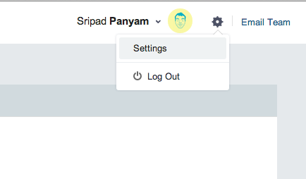

In the Settings page, click on the "App settings" tab. Then paste in your Google API key into the text field that appears for GCM key.
Click the "Save" button underneath the text fields to confirm.

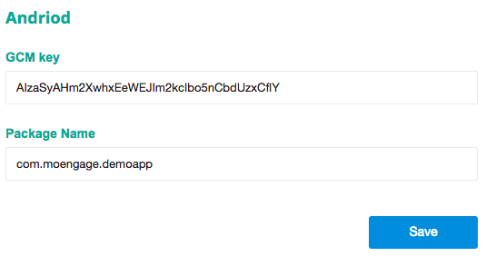

Handling Push Notifications
---------------------------

To enable push notifications, add the following lines to your manifest
file by replacing PACKAGE\_NAME with your package name, you have to
replace the package name 3 times.

::

    <permission android:name="PACKAGE_NAME.permission.C2D_MESSAGE" android:protectionLevel="signature" />
    <uses-permission android:name="PACKAGE_NAME.permission.C2D_MESSAGE" /> 
    <uses-permission android:name="com.google.android.c2dm.permission.RECEIVE" />
    <uses-permission android:name="android.permission.GET_ACCOUNTS" />
    <uses-permission android:name="android.permission.WAKE_LOCK"/>

    <receiver android:name="com.moe.pushlibrary.PushGcmBroadcastReceiver"
            android:permission="com.google.android.c2dm.permission.SEND" >
            <intent-filter>
                <action android:name="com.google.android.c2dm.intent.RECEIVE" />
                <action android:name="com.google.android.c2dm.intent.REGISTRATION" />
                <category android:name="PACKAGE_NAME" />
            </intent-filter>
    </receiver>
    <service android:name="com.moe.pushlibrary.PushGCMIntentService" />
    <receiver android:name="com.moe.pushlibrary.PushGcmRegister" />
    <receiver android:name="com.moe.pushlibrary.SendReport" />

Gcm ids are refreshed after every update, to handle that please put the
following code, note that the PACKAGE\_NAME has to be replaced with your
app package name.

::

    <receiver android:name="com.moe.pushlibrary.PushUpdateReceiver">
    <intent-filter>
            <action android:name="android.intent.action.PACKAGE_REPLACED" />
            <data android:path="PACKAGE_NAME"
                android:scheme="package" />
        </intent-filter>
    </receiver>

Requirements for Rich Landing pages through Push notifications (recommended)
^^^^^^^^^^^^^^^^^^^^^^^^^^^^^^^^^^^^^^^^^^^^^^^^^^^^^^^^^^^^^^^^^^^^^^^^^^^^

You can take the user to a mobile-optimized landing page when clicked on the notification. You can have call-to-action button in the page, which takes to the specific screen in App when clicked. It is recommended to add this capability, though your team might not use it immediately.

Put the following activity as part of manifest for this to work:

::

    <activity 
        android:name="com.moe.pushlibrary.activities.MoEActivity"
        android:parentActivityName="yourparentactivityname" 
    >
        <meta-data
            android:name="android.support.PARENT_ACTIVITY"
            android:value="yourparentactivityname" 
        />
    </activity>

Parent activity name is needed if you want to redirect the user to a particular screen when users click on the up button.
If you don't want to add the parent activity just include the following lines.

::

    <activity 
        android:name="com.moe.pushlibrary.activities.MoEActivity" 
    >
    </activity>

Initializing the SDK and Push Notifications
-------------------------------------------

Put the following code in the first activity onCreate() method

::

    MoEHelper mHelper = new MoEHelper(this);
    mHelper.initialize("GCM Sender ID", "MoEngage APP ID");

GCM Sender ID - the twelve digit sender ID of your Google API project.
MoEngage APP ID - This is an application specific id, which MoEngage team must have shared with you. You can also find it in the 'App Settings' tab of the 'Settings' page of your MoEngage account.

Put the following code after the above initialization code to register for push

::

    mHelper.Register(drawableResourceId);
    drawableResourceId - for eg. R.drawable.icon

Tracking user activity
-------------------------

Put the following code in every activity of the app. This step is crucial for all the events to be tracked at the right time.

::

    // in onStart()
    mHelper.onStart(this);
    
    // in onStop()
    mHelper.onStop(this);  
    
    // in onResume()
    mHelper.onResume(this);
    
    // in onPuase()
    mHelper.onPause(this);

as shown in the codes below

::

    private MoEHelper mHelper;
    protected void onCreate(Bundle savedInstanceState) {
    	super.onCreate(savedInstanceState);
    	mHelper = new MoEHelper(this);
    }

    protected void onStart() {
        super.onStart();
        MoEHelper.getInstance(this).onStart(this);
    }
    protected void onStop() {
        super.onStop();
        MoEHelper.getInstance(this).onStop(this);
    }
    
    protected void onPause() {
        super.onPause();
        mHelper.onPause(this);
    }
	
    protected void onResume() {
    	super.onResume();
    	mHelper.onResume(this);
    }

Tracking your first event
-------------------------

Once you've initialized the SDK, you can track an event using trackEvent with the event name and it's characteristics (attributes).
Make sure you have implemented Tracking User Activity before you can track an event.

Every event has 2 attributes, action name and key, value pairs which represent additional information about the action. Add all the additional information which you think would be useful for segmentation while creating campaigns.
For eg. the following code tracks a purchase event of a product. We are including attributes like amount, quantity, category which describe the event we are tracking.

::

    JSONObject newJson = new JSONObject();
        try {
          newJson.put("product", "Moto E");
          newJson.put("amount", 7000);
          newJson.put("currency", "Rs.");
          newJson.put("category", "Mobiles");
          newJson.put("quantity", 2);
    } catch (JSONException e) {
                // json exception
        }
    MoEHelper.getInstance(mCurrentContext).trackEvent("Made Purchase", newJson);
    
mCurrentContext - context instance, please change the name accordingly

*Please make sure that you are tracking event attributes without changing their data types. For instance, in the above purchase event, amount and quantity are tracked in the numeric form. Our system detects the data type automatically unless you explicitly specify it as a string.*

To pass location as one of the parameters for the event use the following code:

::

    MoEHelperUtils.setLocation(newJson, "attribute name", lat, lng);
    
    // 1st argument - json object which contains all the parameters for the event
    // 2nd argument - attribute name that you want to assign to the location
    // 3rd, 4th - latitude and longitude of a location.
    // for instance
    
    JSONObject newJson = new JSONObject();
        try {
          newJson.put("city", "New York");
          MoEHelperUtils.setLocation(newJson, "city search", 40.77, 73.98);
    } catch (JSONException e) {
                // json exception
        }

    MoEHelper.getInstance(mCurrentContext).trackEvent("search", newJson);

*You should track all the events relevant to your business, so that your product managers and marketers can segment your app users and create targeted campaigns.*

Testing event tracking after integration
^^^^^^^^^^^^^^^^^^^^^^^^^^^^^^^^^^^^^^^^

To test event tracking, first you need to login to the MoEngage portal with the credentials provided for your app.

After adding event tracking in the app as shown in the guide above, you can visit `For Developers`_ link through the MoEngage portal to check whether the events are being tracked, as you use.
.. _For Developers: http://app.moengage.com/latestActivity

.. image:: images/11.png

As users use the application, events data is stored locally and sent in regular intervals of 30 seconds to avoid any performance impact. So, you might need to wait for sometime to see the events in the portal.

Send a push notification for testing
------------------------------------

Once you have set up your permissions and set up GCMReciever as a receiver of Google Cloud Messaging notifications in your AndroidManifest.xml file and
added the initialization code mentioned above, you're ready to send a notification!

Install and run your application on an Android device (not the emulator, it can't receive notifications).
Make sure to run the app until the calls to the initialization code mentioned above has been run. For apps built
according to our recommendations, these calls are in the onCreate method of your main application activity, so it is enough to simply open the app. Press the back button to close your app.

Now log in to your MoEngage account and select `Create Campaign`_ from the left-hand navigation, and click on 'General Push Campaign'.

.. _Create Campaign: http://app.moengage.com/newpushcampaign

If this is the first time you are testing MoEngage SDK with your app, you can just set a test message, leave the screen selection part, set the scheduling to run 'as soon as possible' and create the campaign as shown below:

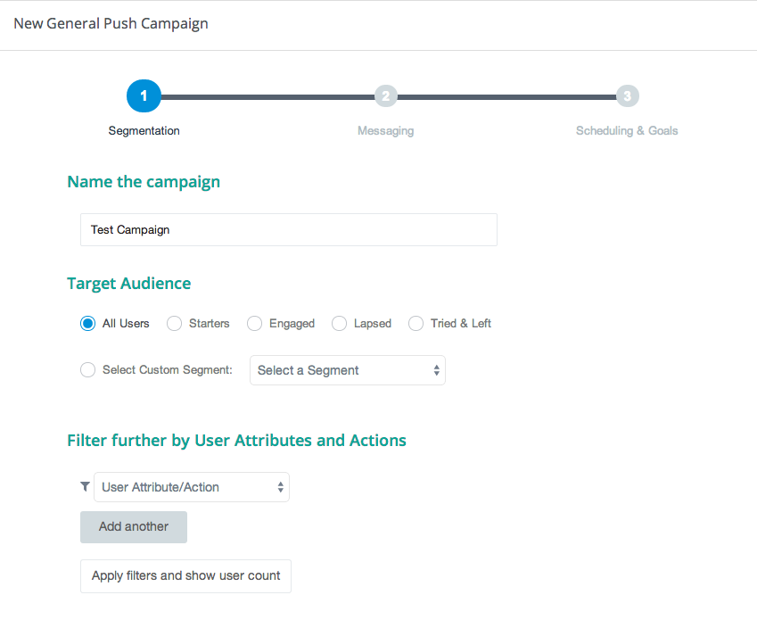

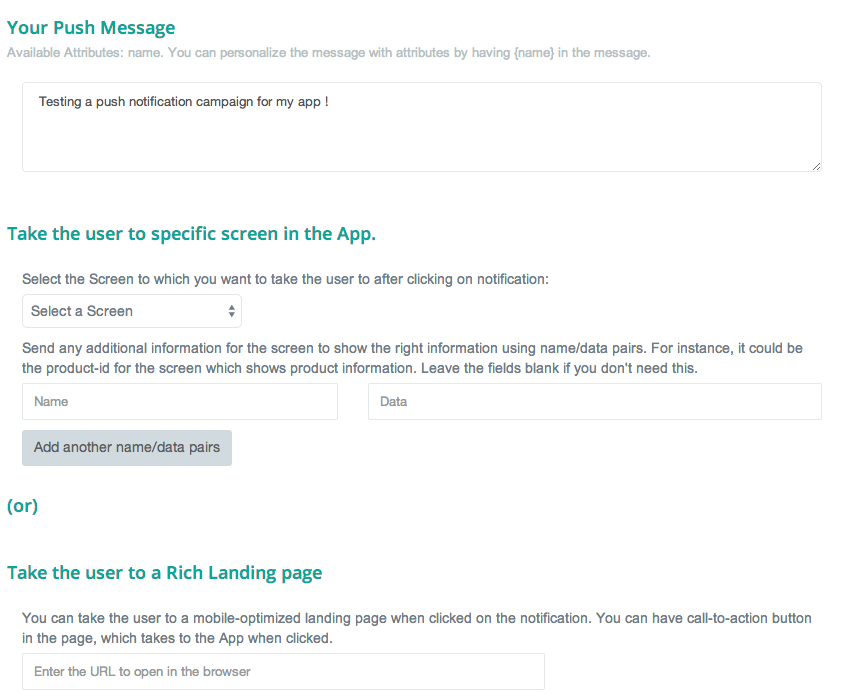

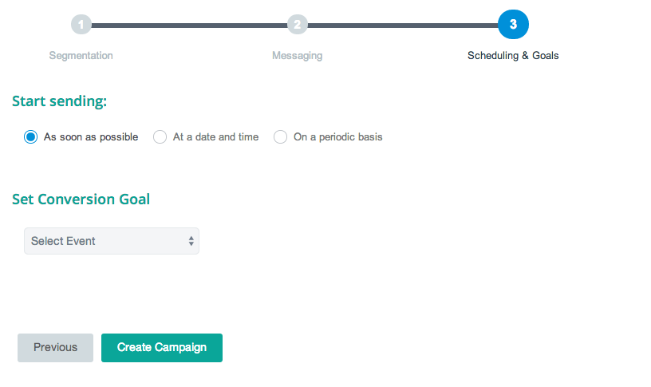

Once the campaign is created, the message should show up on your device.

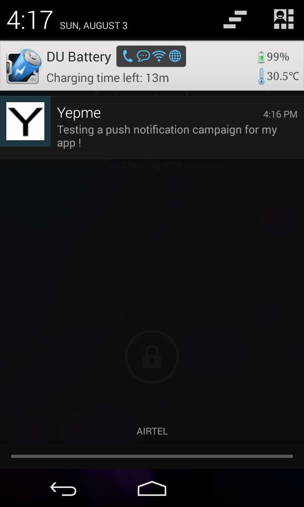

*Note: If MoEngage SDK has been integrated earlier with your app and has been released to your users, please don't create a campaign targeting all users. You can create a campaign targeting only your device by setting the filters based on user attributes.*

Setting user attributes
-------------------------

Use the following lines to set User attributes like Name, Email, Mobile, Gender, etc.

For eg. to set unique id for the user

::

    MoEHelper.getInstance(mCurrentContext).setUserAttribute(MoEHelperConstants.USER_ATTRIBUTE_UNIQUE_ID, uniqueId);
    
uniqueId - unique id for the user specific to your system, so that there is a unique identifier mapping between your platform and MoEngage.

You can use MoEHelperConstants class to set the default user attributes like mobile number, gender, user name, brithday. Birthday has to be in the format - "mm/dd/yyyy". The constants for these default attributes in MoEHelperConstants are mentioned below:

::

    USER_ATTRIBUTE_UNIQUE_ID
    USER_ATTRIBUTE_USER_EMAIL
    USER_ATTRIBUTE_USER_MOBILE
    USER_ATTRIBUTE_USER_NAME   # incase you have full name 
    USER_ATTRIBUTE_USER_GENDER
    USER_ATTRIBUTE_USER_FIRST_NAME # incase you have first and last name separately
    USER_ATTRIBUTE_USER_LAST_NAME
    USER_ATTRIBUTE_USER_BDAY
    GENDER_MALE = "male";
    GENDER_FEMALE = "female";

to set user email

::

    MoEHelper.getInstance(mCurrentContext).setUserAttribute(MoEHelperConstants.USER_ATTRIBUTE_USER_EMAIL, email);
    
email - email of the user

To set user location, use the following line

::

    MoEHelper.getInstance(mCurrentContext).setUserLocation(lat, lng);

lat - latitude of the location
lng - longitude of the location

Setting custom user attributes
^^^^^^^^^^^^^^^^^^^^^^^^^^^^^^^

The above examples demonstrate how to set predefined attributes and their values. To set custom attributes use the following syntax.

::

    MoEHelper.getInstance(mCurrentContext).setUserAttribute(key, value);

key - the name you want to give to the attribute
value - the value you would like to assign to it

Setting user attributes for existing registered users
^^^^^^^^^^^^^^^^^^^^^^^^^^^^^^^^^^^^^^^^^^^^^^^^^^^^^

This applies if your app has been live and has users using before integrating MoEngage. We recommend you to set the attributes for existing registered users who
have been using your app when they use after updating to the app with MoEngage SDK.

You can do this by writing the user attributes setting code (mentioned earlier) in the first screen existing users see after updating the app.

This helps your product/marketing team to target based on the attributes of all users who use the updated app.

User Acquisition source tracking
--------------------------------

This helps us to attribute your users with the source through which users found your app. To add Install Attribution (User Acquisition Source) tracking, add the following lines to your manifest:

::

    <receiver android:name="com.moe.pushlibrary.InstallReceiver">
        <intent-filter>
            <action android:name="com.android.vending.INSTALL_REFERRER"/>
            </intent-filter>
    </receiver>
    

MoEngage Integration with HasOffers MAT (MobileAppTracking)
----------------------------------------------------------

The integration works by notifying MoEngage of installs using HasOffers MAT REST API. To do so, you will need to set up a server postback in your MobileAppTracking account for each one of your mobile apps. Here we are focusing only on the frontend.

In the app when implementing MoEngage and MobileAppTracking SDKs, you would collect the Google Advertising ID and/or Android ID for MAT Integration. You'll need to set these unique device identifiers as user attributes for mapping between MoEngage and MobileAppTracking platforms.

Reference: MobileAppTracking (MAT) Android Integration guide (https://developers.mobileapptracking.com/android-sdk/)

::

    // Collect Google Play Advertising ID; REQUIRED for attribution of Android apps distributed via Google Play
    new Thread(new Runnable() {
        @Override public void run() {
            // See sample code at http://developer.android.com/google/play-services/id.html
            try {
                Info adInfo = AdvertisingIdClient.getAdvertisingIdInfo(getApplicationContext());
                
                // mobileAppTracker.setGoogleAdvertisingId(adInfo.getId(), adInfo.isLimitAdTrackingEnabled());
                
                // Add the below code wherever you are tracking the Advertising ID for HasOffers MAT shown above

                MoEHelper.getInstance(mCurrentContext).setUserAttribute("GOOGLE_ADVERTISING_ID", adInfo.getId());
                MoEHelper.getInstance(mCurrentContext).setUserAttribute("GOOGLE_ADVERTISING_ENABLED", adInfo.isLimitAdTrackingEnabled());
                
            } catch (IOException e) {
                // Unrecoverable error connecting to Google Play services (e.g.,
                // the old version of the service doesn't support getting AdvertisingId).
                //mobileAppTracker.setAndroidId(Secure.getString(getContentResolver(), Secure.ANDROID_ID));
                MoEHelper.getInstance(mCurrentContext).setUserAttribute("ANDROID_ID", Secure.getString(getContentResolver(), Secure.ANDROID_ID));
            } catch (GooglePlayServicesNotAvailableException e) {
                // Google Play services is not available entirely.
                //mobileAppTracker.setAndroidId(Secure.getString(getContentResolver(), Secure.ANDROID_ID));
                MoEHelper.getInstance(mCurrentContext).setUserAttribute("ANDROID_ID", Secure.getString(getContentResolver(), Secure.ANDROID_ID));
            } catch (GooglePlayServicesRepairableException e) {
                // Encountered a recoverable error connecting to Google Play services.
                //mobileAppTracker.setAndroidId(Secure.getString(getContentResolver(), Secure.ANDROID_ID));
                MoEHelper.getInstance(mCurrentContext).setUserAttribute("ANDROID_ID", Secure.getString(getContentResolver(), Secure.ANDROID_ID));
            } catch (NullPointerException e) {
                // getId() is sometimes null
                //mobileAppTracker.setAndroidId(Secure.getString(getContentResolver(), Secure.ANDROID_ID));
                MoEHelper.getInstance(mCurrentContext).setUserAttribute("ANDROID_ID", Secure.getString(getContentResolver(), Secure.ANDROID_ID));
            }
        }
    }).start();

    // if you are separately taking ANDROID ID for HasOffers MAT, add the following line of code.
    
    import android.provider.Settings.Secure;
    MoEHelper.getInstance(mCurrentContext).setUserAttribute("ANDROID_ID", Secure.getString(getContentResolver(), Secure.ANDROID_ID));

    
GeoFencing (Optional - not recommended for all apps)
---------------------------------------------------

To use geofencing, your app must request ACCESS_FINE_LOCATION. To request this permission, add the following element as a child element of the <manifest> element:

::

    <uses-permission android:name="android.permission.ACCESS_FINE_LOCATION"/>

Geo-fencing is an extension of push messaging, so please complete the steps required for push notification before going any further.

Add the following line to the manifest..

::

    <service android:name="com.moe.geofence.MOEGeoFenceIntentService"></service>
    
To setup geofences inside the application, call setGeoFences(lat, lng, context) method. lat and lng are the location around which you wish to set the geofences. Since you can only create a maximum of 90 geofences per app user, you can use the lat/lng to create the geofences required, if you want to create more than 90 geofences across all users.

::

    MoEHelper mHelper = new MoEHelper(this);
    mHelper.setGeoFences(17.1832, 23.3292, this);
    
In the above example, MoEngage sets up the geofences around 17.1832,23.3292 location co-ordinates. If you are not sure about the location (or) you just want to create geofences less than 90 across your users, pass 0.0 value for both lat and lng. The app sets up the 90 nearest geofences.

Testing Geo-fencing
--------------------------------

To test whether Geo-fencing is working, create a Geo-fence Campaign under the campaigns section in the dashboard. Add your current location as one of the geofence and save the campaign. Now, open the app and make sure the **setGeoFences** code is run. You should get a push notification with the message that was part of the campaign.

Notification Center
--------------------------------

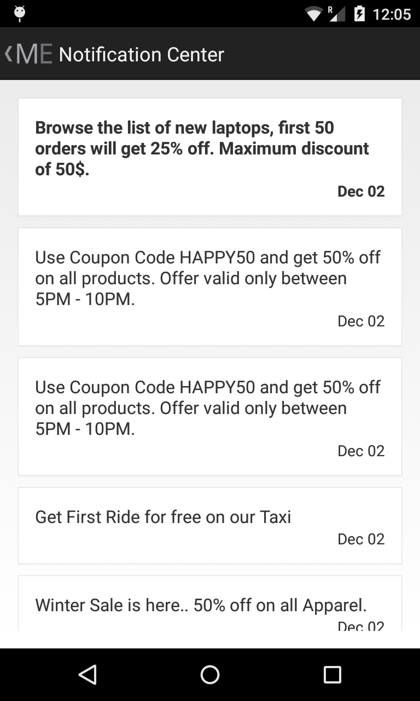

Add the following activity to the manifest file.

::

    <activity
        android:name="com.moe.pushlibrary.activities.MoEInboxActivity">
    </activity>
    
To Change the name of the Notification Center Title on the Action Bar - change the resource name of "moe_inbox_name" in strings.xml

To get the unread messages count, call the following method of MoEHelper Class in onResume() of your activity.

::

    mHelper.getUnreadMessagesCount()
    
    
Call the **MoEInboxActivity** from the ActionBar or the place where you show the NotificationCenter Icon.
    
    

In-app Messaging 
---------------------------------

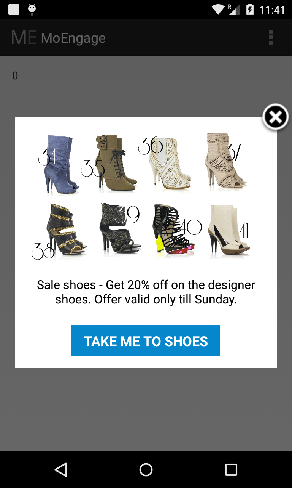

Make sure you have **onResume()** and **onPause()** methods of MoEngage called in all the activities you would like to show In-app Message. We recommend not to use these methods in your Splash Screen activity.

    
CheckList
---------------------------------------------------

1. Make sure you have added **onStop()**, **onStart()**, **onPause()**, **onResume()** methods of MoEngage in all your activities.
2. Test the Push Campaign on real device.
3. Track Events comprehensively that meet your marketing goals.
