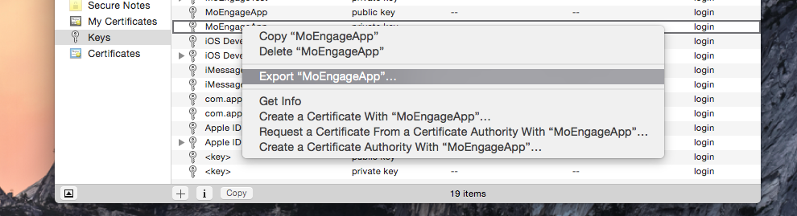

iOS Integration guide
===============================

Importing the MoEngage library 
-----------------------------------------

Step 1 - Get the latest MoEngage library release
^^^^^^^^^^^^^^^^^^^^^^^^^^^^^^^^^^^^^^^^^^^^^^^^^

Download the latest sdk from the following page

http://docs.moengage.com/en/latest/download_sdks.html#ios

Step 2 - Adding library and header files to the project 
^^^^^^^^^^^^^^^^^^^^^^^^^^^^^^^^^^^^^^^^^^^^^^^^^^^^^^

1. Add the given library file (.a extension) to your project. Please check the following page for instructions.
https://developer.apple.com/library/ios/technotes/iOSStaticLibraries/Articles/configuration.html

2. Add the given header files (.h extensions) , by dragging and dropping the files in to your project.

3. Add the following compiler flag: -ObjC. Select your project. Go to "Build Settings" ->"Linker" ->"Other Linker Flags" and add this flag.

4. Under Build Phases > Link Binary With Libraries - Add AdSupport.Framework. This is needed for IDFA.

After these 4 steps you are all set to use the MoEngage Library now.

App Delegate Changes
----------------------
In your AppDelegate.m add the following code in the respective methods..

ApplicationID - a unique id will be provided to you from MoEngage. You can also find it in the 'App Settings' tab of the 'Settings' page of your MoEngage account.

::

	- (BOOL)application:(UIApplication *)application didFinishLaunchingWithOptions:(NSDictionary *)launchOptions 
	{
    		[[MoEngage sharedInstance] initializeWithApiKey:@"ApplicationID" inApplication:application withLaunchOptions:launchOptions];
    		return YES;
	}

	- (void)applicationDidEnterBackground:(UIApplication *)application {
    		[[MoEngage sharedInstance] stop:application];
	}

	- (void)applicationDidBecomeActive:(UIApplication *)application {
    		[[MoEngage sharedInstance]applicationBecameActiveinApplication:application];
	}

	- (void)applicationWillTerminate:(UIApplication *)application {
		[[MoEngage sharedInstance]applicationTerminated:application];
	}

	- (void) application:(UIApplication *)application didReceiveRemoteNotification:(NSDictionary *)userInfo 
	{
    		[[MoEngage sharedInstance]didReceieveNotificationinApplication:application withInfo:userInfo];
	}

	- (void)application:(UIApplication*)application didRegisterForRemoteNotificationsWithDeviceToken:(NSData*)deviceToken
	{
    		[[MoEngage sharedInstance]registerForPush:deviceToken];
	}
	
	-(void)application:(UIApplication *)application didFailToRegisterForRemoteNotificationsWithError:(NSError *)error
	{
    		[[MoEngage sharedInstance]didFailToRegisterForPush];
	}

Tracking your first event
-------------------------

You can track an event using trackEvent with the event name and it's characteristics (attributes).

Every event has 2 attributes, action name and key, value pairs as NSMutableDictionary which stores additional information about the action. Add all the additional information which you think would be useful for segmentation while creating campaigns.
For eg. the following code tracks a purchase event of a product. We are including attributes like product, category which describe the event we are tracking.

::

    NSMutableDictionary* mut_dict = [NSMutableDictionary dictionaryWithDictionary:@{@"product":@"Moto E",@"category":@"Mobiles"}];
    [[MoEngage sharedInstance]trackEvent:@"Made Purchase" andPayload:mut_dict];

If you don't have any attributes, just pass nil as second argument. for eg.

::

    [[MoEngage sharedInstance]trackEvent:@"Made Purchase" andPayload:nil];
    

To pass location as key value pairs, Use the following approach

for eg. event name is "location_search", where we have to pass "loc" as additional information with values as latitude and longitude of the location.

::

    NSMutableDictionary *mut_dict = [[NSMutableDictionary alloc]init];
    [MoEngage setLocationwithLat:79.3249 lng:32.328 withName:@"loc" inDictionary:mut_dict];
    [[MoEngage sharedInstance]trackEvent:@"location_search" andPayload:mut_dict];

*Please make sure that you are tracking event attributes without changing their data types. For instance, in the above purchase event, amount and quantity are tracked in the numeric form. Our system detects the data type automatically unless you explicitly specify it as a string.*

*You should track all the events relevant to your business, so that your product managers and marketers can segment your app users and create targeted campaigns.*

Testing event tracking after integration
^^^^^^^^^^^^^^^^^^^^^^^^^^^^^^^^^^^^^^^^

To test event tracking, first you need to login to the MoEngage portal with the credentials provided for your app.

After adding event tracking in the app as shown in the guide above, you can visit `For Developers`_ link through the MoEngage portal to check whether the events are being tracked, as you use.

.. _For Developers: http://app.moengage.com/latestActivity

.. image:: images/11.png

As users use the application, events data is stored locally and sent as a batch at app close or termination to avoid any performance impact. So, you should close or terminate the app to see the events in the portal.

Setting user attributes
-------------------------

Use the following lines to set User attributes like Name, Email, Mobile, Gender, etc.

For eg. to set unique id for the user

::

    [[MoEngage sharedInstance]setUserAttribute:uniqueId forKey:USER_ATTRIBUTE_UNIQUE_ID];
    
uniqueId - unique id for the user specific to your system, so that there is a unique identifier mapping between your platform and MoEngage.

You can also set the default user attributes like mobile number, gender, user name, brithday. Birthday has to be in the format - "mm/dd/yyyy". The constants for these default attributes in MoEHelperConstants are mentioned below:

::

    USER_ATTRIBUTE_UNIQUE_ID
    USER_ATTRIBUTE_USER_EMAIL
    USER_ATTRIBUTE_USER_MOBILE
    USER_ATTRIBUTE_USER_NAME   # incase you have full name 
    USER_ATTRIBUTE_USER_GENDER
    USER_ATTRIBUTE_USER_FIRST_NAME # incase you have first and last name separately
    USER_ATTRIBUTE_USER_LAST_NAME
    USER_ATTRIBUTE_USER_BDAY
    GENDER_MALE = "male";
    GENDER_FEMALE = "female";

for eg. to set email attribute for a user

::

    [[MoEngage sharedInstance]setUserAttribute:email forKey:USER_ATTRIBUTE_USER_EMAIL];
    
email - email of the user

To set user location, use the following syntax

::

    [[MoEngage sharedInstance] setUserLocationwithLatitude:lat withLongitude:lng];

lat - latitude of the location
lng - longitude of the location

Setting custom user attributes
^^^^^^^^^^^^^^^^^^^^^^^^^^^^^^^

The above examples demonstrate how to set predefined attributes and their values. To set custom attributes use the following syntax.

::

    [[MoEngage sharedInstance]setUserAttribute:value forKey:key];

key - the name you want to give to the attribute
value - the value you would like to assign to it

Setting user attributes for existing registered users
^^^^^^^^^^^^^^^^^^^^^^^^^^^^^^^^^^^^^^^^^^^^^^^^^^^^^

This applies if your app has been live and has users using before integrating MoEngage. We recommend you to set the attributes for existing registered users who
have been using your app when they use after updating to the app with MoEngage SDK.

You can do this by writing the user attributes setting code (mentioned earlier) in the first screen existing users see after updating the app.

This helps your product/marketing team to target based on the attributes of all users who use the updated app.

Push Notifications
-----------------------------------------

If you already have production and development key file and certificate files, Proceed to Uploading Key file to MoEngage section.

Generating the Certificate Signing Request (CSR)
^^^^^^^^^^^^^^^^^^^^^^^^^^^^^^^^^^^^

Open Keychain Access on your Mac (it is in Applications/Utilities) and choose the menu option Request a Certificate from a Certificate Authority… .

You should now see the following window:

Enter your email address here. Enter your app name for Common Name. This allows us to easily find the private key later.
Check Saved to disk and click Continue. Save the file as “Yourappname.certSigningRequest”.

Go to the Keys section of Keychain Access, you will see that a new private key has appeared in your keychain. Right click it and choose Export.
Save the private key as Yourappname.p12 and enter a passphrase.

Creating the App ID and SSL Certificate
^^^^^^^^^^^^^^^^^^^^^^^^^^^^^^^^^^^^^^^^
Log in to the iOS Dev Center and “Select the Certificates, Identifiers and Profiles” from the right panel. Select Certificates in the iOS Apps section.
Go to App IDs in the Identifiers and click the + button.

.. image:: images/apns6.png

Fill the following details in the window presented:
App ID Description: yourappname
In the App Services make sure you Check the Push Notifications Checkbox
Explicit App ID: your app bundle id (in the format com.example.exampleapp)

Press the Continue button. You will be asked to verify the details of the app id, if everything seems okay click Submit.
You have successfully registered a new App ID.

After you have made the App ID, it shows up in the App IDs list. Select the yourappname app ID from the list. This will open up a window as shown below:

.. image:: images/apns8.png

There are two orange lights that say “Configurable” in the Development and Distribution column. This means your App ID can be used with push, but you still need to set this up. Click on the Edit button to configure these settings.

Scroll down to the Push Notifications section and select the Create Certificate button in the Development SSL Certificate section.

The “Add iOS Certificate” wizard comes up, The first thing it asks you is to generate a Certificate Signing Request. You already did that, so click Continue. In the next step you upload the CSR. Choose the CSR file that you generated earlier and click Generate.

In the Your certificate is ready window, Download the certificate, it is named “aps_development.cer”.

Making a PEM file
^^^^^^^^^^^^^^^^^^^^^^^^^^^^^^^^^^^
So now you have 2 files:
The private key as a p12 file  - yourappname.p12 and
the SSL certificate -  aps_development.cer

Convert the .cer file into a .pem file:
::

    $ openssl x509 -in aps_development.cer -inform der -out yourappnamecert.pem

Convert the private key’s .p12 file into a .pem file:
::

    $ openssl pkcs12 -nocerts -out yourappnamekey.pem -in yourappname.p12
    Enter Import Password: 
    MAC verified OK
    Enter PEM pass phrase: 
    Verifying - Enter PEM pass phrase:

Combine the certificate and key into a single .pem file:
::

    cat yourappnamecert.pem yourappnamekey.pem > finalkeytobeuploaded.pem

Making the Provisioning Profile
^^^^^^^^^^^^^^^^^^^^^^^^^^^^^^^^^^^^
Click the Provisioning Profiles button in the sidebar and click the + button.
Create new provisioning profile
This will open up the iOS provisioning profile wizard.
Select the “iOS App development” option button in the first step of the wizard and press Continue.

Select the yourappname app id that you created in the previous section. This will ensure that this provisioning profile is explicitly tied to the PushChat app.

Select Certificate for Provisioning profile
Select the devices you want to include in this provisioning profile. Since you’re creating the development profile you would typically select the devices you use for development here.
Select devices for development provisioning profile
Set the provisioning profile name as “Yourappname Development” as shown below.
Press the Download button, this will download the newly created Development provisioning profile.
Add the provisioning profile to Xcode by double-clicking it or dragging it onto the Xcode icon.

Uploading Key file to MoEngage
^^^^^^^^^^^^^^^^^^^^^^^^^^^^^^^^^^^^

Open the settings page in the MoEngage Dashboard, under the App Settings tab, following the steps for uploading the key.

1. Upload the pem file which contains both certificate and key information.
2. Enter the password for the key.

.. image:: images/apnsmoe2.png

Adding push notification code
^^^^^^^^^^^^^^^^^^^^^^^^^^^^^^

Include the following code sample in your application:didFinishLaunchingWithOptions: method:

::

    if (floor(NSFoundationVersionNumber) <= NSFoundationVersionNumber_iOS_7_1) {
	[[UIApplication sharedApplication] registerForRemoteNotificationTypes:
	(UIRemoteNotificationTypeAlert |
	UIRemoteNotificationTypeBadge |
	UIRemoteNotificationTypeSound)];
    } else {
	UIUserNotificationSettings *settings = [UIUserNotificationSettings settingsForTypes:(UIUserNotificationTypeBadge|UIUserNotificationTypeAlert | UIUserNotificationTypeSound) categories:nil];
	[[UIApplication sharedApplication] registerUserNotificationSettings:settings];
	[[UIApplication sharedApplication] registerForRemoteNotifications];
    }
    
    
Custom Handler for Deep Linking push
^^^^^^^^^^^^^^^^^^^^^^^^^^^^^^^^

In order to open "Deep Links" that are sent to the device as a Key/Value pair along with a push notification you must implement a custom handler.

::

    - (BOOL) application:(UIApplication *)application didFinishLaunchingWithOptions:(NSDictionary *)launchOptions {
  	// Code should be inserted here to handle when the app just launched ...
  	NSDictionary *pushDictionary = [launchOptions valueForKey:UIApplicationLaunchOptionsRemoteNotificationKey];
  	if (pushDictionary) {
    	    [self customPushHandler:pushDictionary];
  	}
    }
    
    - (void) application:(UIApplication *)application didReceiveRemoteNotification:(NSDictionary *)userInfo {
  	[self customPushHandler:userInfo];
    }
    
    - (void) customPushHandler:(NSDictionary *)notification {
  	if (notification !=nil && [notification objectForKey:@"app_extra"] != nil) {
            NSDictionary* app_extra_dict = [notification objectForKey:@"app_extra"];
            NSLog(@"%@",app_extra_dict);
            // Here based on the extras key-value pair, you can open specific screens that's part of your app
    	}
    }
    
In-app Messaging 
-----------------------------------------

To use In-app Messaging, add the code below to the view controller(s) in which you want to show the In-app.

::

 	[[MoEngage sharedInstance]handleInAppMessage];
 	[MoEngage sharedInstance].delegate = self;
 	
To handle the button action for In-app, conform your view controller to MOInAppDelegate (optional). The method will provide the data which will help you to navigate screens or take appropriate actions.

 ::
 
 
 	-(void)inAppButtonClickWithText:(NSString *)text andData:(NSDictionary *)dataDictionary{
 	// Here the dataDictionary will have the screen name and the key value pairs
 	}
 	
Testing In-app Messaging
-----------------------------------------

In the dashboard, create an In-app Messaging campaign (Campaigns -> Create Campaign -> In-app Messaging). Now open the app to see the In app message popup.

Notification Center 
-----------------------------------------

This is a drop in view controller which contains the read and unread push notifications. Even if the user has not clicked on a notification, it will be present in the Inbox and will be highlighted to signify it’s unread status. The title and the look and feel of the view is also customisable.

Inbox view controller is added as a child view controller to your own controller. This helps you get the delegate callback in the same controller, which you can further use for navigation to different screens.

How to use Inbox:
^^^^^^^^^^^^^^^^^^^^^^^^^^^^^^^^^^^^
1. #import "MOInboxViewController.h" and "MOInbox.h" in your View Controller.

2. Create a property - @property(nonatomic, strong) MOInboxViewController *myInboxController.

3. In viewDidLoad, add 
::

	self.myInboxController = [MOInbox initializeInboxOnController:self];

You are all set. This will add Inbox as a child controller to your view controller.

Advanced settings:
^^^^^^^^^^^^^^^^^^^^^^^^^^^^^^^^^^^^
1. You can push/present your controller. If you push your controller, make sure to add "Done" or "Cancel" button as a UIBarButtonItem to dismiss your View Controller.

2. You can get the delegate callback of the click action on inbox cells:
::
	self.myInboxController.delegate = self;
	
	-(void)inboxCellSelectedWithData:(NSDictionary *)dataDict{
    		NSLog(@"data dict on click is %@", dataDict);
	}

You can use this data for tracking events or navigation to another screen.

3. You can customise the look and feel of the inbox view controller using the method:
::

	    [self.myInboxController customiseInboxWithCellTextColor:[UIColor blackColor] fontForReadMsg:[UIFont fontWithName:@"AvenirNext-Regular" size:18] fontForUnreadMsg:[UIFont fontWithName:@"AvenirNext-Bold" size:18] dateTextColor:[UIColor grayColor] font:nil cellBackgroundColor:[UIColor clearColor]];

4. You can also change the frame of the Inbox as per your need, but you will have to ensure to remove the child controller if you wish to dismiss while staying in the same view.

Releasing the app to the App Store
-----------------------------------------

MoEngage uses IDFA. Apple has guidelines on how developers can use IDFA.

When submitting your app to the app store, you have to disclose your IDFA uses:

1. Serve advertisements within the app.
- MoEngage does not serve ads. Plese check this box if you show ads in your app.

2. Attribute this app installation to a previously served advertisement.
- Please check this box. MoEngage uses IDFA for install attribution.

3. Attribute an action taken within this app to a previously served advertisement
- MoEngage does not attribute actions to advertisements.

4. iOS Limit Ad Tracking
- Please check this box. MoEngage SDK collects the iOS “Limit Ad Tracking” ("advertisingTrackingEnabled") flag when collecting IDFA. MoEngage fully complies with Apple requirement.

Make sure that all your partners fully comply with this section before releasing the app to the App Store.  

