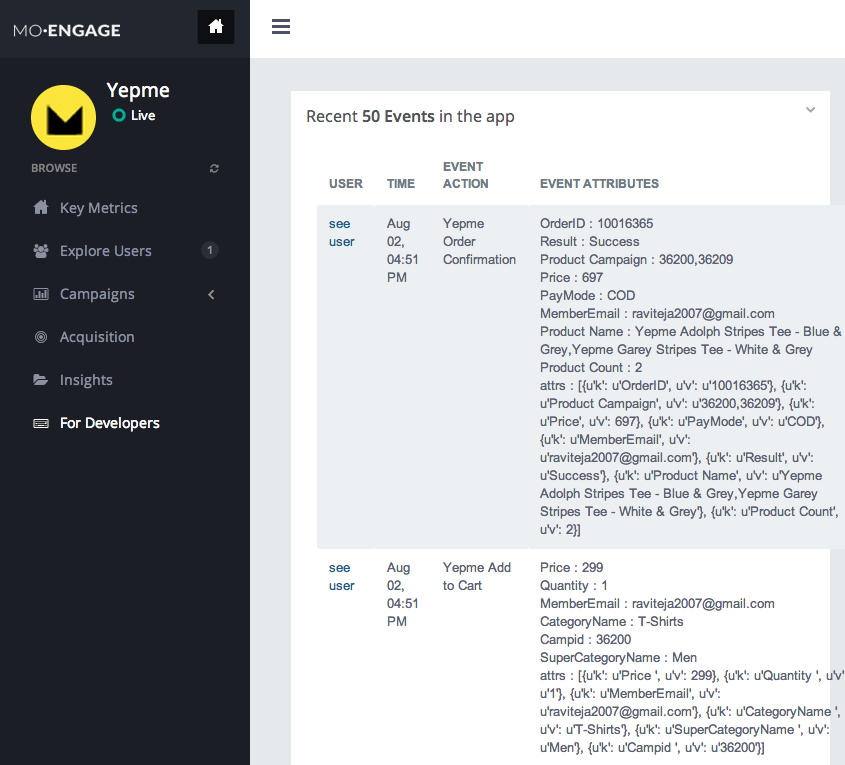
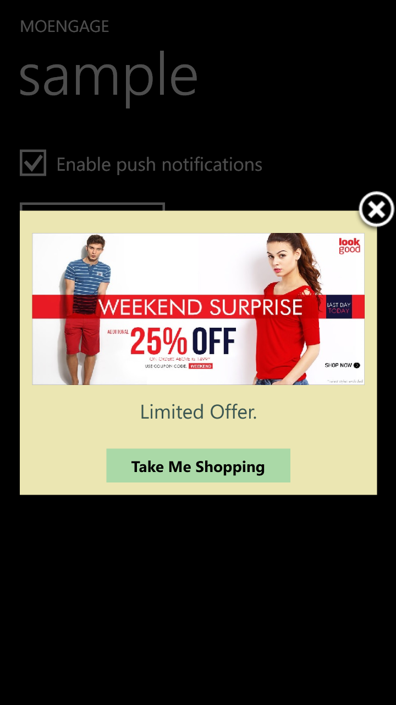
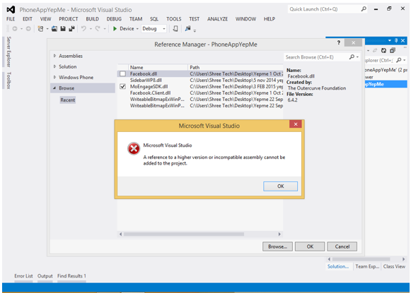
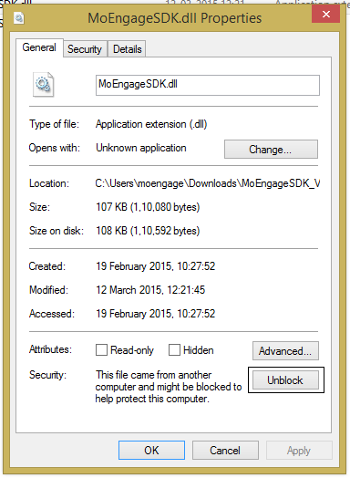
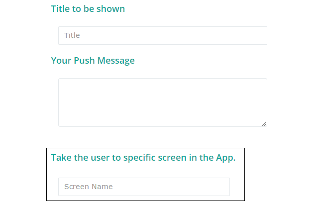

Windows Phone Integration guide
===============================

Installing the MoEngage library - Visual Studio
-----------------------------------------

Step 1 - Get the latest MoEngage library release
^^^^^^^^^^^^^^^^^^^^^^^^^^^^^^^^^^^^^^^^^^^^^^^^^

Download the latest sdk from the following page

http://docs.moengage.com/en/latest/download_sdks.html#windows

Step 2 - Refer the dll file to your project
^^^^^^^^^^^^^^^^^^^^^^^^^^^^^^^^^^^^^^^^^^^^^^^^^^^^^^

Add the given MoEngageSDK.dll file to the project. Project -> Add Reference -> Browse for the dll file in your computer and add it as reference.

Step 3 - Adding capabilities
^^^^^^^^^^^^^^^^^^^^^^^^^^^^^^^^^^^^^^^^^^^^^^^^^^^^
open the WMAppManifest.xml in the properties, enable the following capabilities

::

    ID_CAP_NETWORKING
    ID_CAP_PUSH_NOTOFICATION
    ID_CAP_IDENTITY_DEVICE

Tracking User Sessions
----------------------
In your App.xaml.cs add the following code in the respective methods..

ApplicationID - a unique id will be provided to you from MoEngage. You can also find it in the 'App Settings' tab of the 'Settings' page of your MoEngage account.

::

    private void Application_Launching(object sender, LaunchingEventArgs e)
    {               
        MoEngage.OpenSession("ApplicationID", true);
    }
    
    private void Application_Activated(object sender, ActivatedEventArgs e)
    {
        MoEngage.OpenSession("ApplicationID", true);
    }
    
    private void Application_Deactivated(object sender, DeactivatedEventArgs e)
    {
        MoEngage.CloseSession();
    }
    
    private void Application_Closing(object sender, ClosingEventArgs e)
    {
        MoEngage.CloseSession();
    }

Tracking Notifications
------------------------------------
Add the below to InitializePhoneApplication method in App.xaml.cs

::

    RootFrame.Navigated += MoEngage.Navigated;

Using MoEngage code 
-------------------------
Add the below to all code files where MoEngage SDK is used.

::

    using MoEngageSDK;
    
Use MoEngage.<method> to call a method.

Tracking your first event
-------------------------

Once you've added dll as reference, you can track an event using trackEvent with the event name and it's characteristics (attributes).

Every event has 2 attributes, action name and key, value pairs which represent additional information about the action. Add all the additional information which you think would be useful for segmentation while creating campaigns.
For eg. the following code tracks a purchase event of a product. We are including attributes like amount, quantity, category which describe the event we are tracking.

::

    MoEngage.trackEvent("Made Purchase", new {product="Moto E", amount=7000, currency = "Rs", category = "Mobiles"});

or

::

    var attrs = new {product="Moto E", amount=7000, currency = "Rs", category = "Mobiles"};
    MoEngage.trackEvent("Made Purchase", attrs);
    
    
If you don't have any attributes, just pass None as second argument. for eg.

::

    MoEngage.trackEvent("Made Purchase", null);
    

*Please make sure that you are tracking event attributes without changing their data types. For instance, in the above purchase event, amount and quantity are tracked in the numeric form. Our system detects the data type automatically unless you explicitly specify it as a string.*

*You should track all the events relevant to your business, so that your product managers and marketers can segment your app users and create targeted campaigns.*

Testing event tracking after integration
^^^^^^^^^^^^^^^^^^^^^^^^^^^^^^^^^^^^^^^^

To test event tracking, first you need to login to the MoEngage portal with the credentials provided for your app.

After adding event tracking in the app as shown in the guide above, you can visit `For Developers`_ link through the MoEngage portal to check whether the events are being tracked, as you use.

.. _For Developers: http://app.moengage.com/latestActivity

As users use the application, events data is stored locally and sent in regular intervals of 30 seconds to avoid any performance impact. So, you might need to wait for sometime to see the events in the portal.

Setting user attributes
-------------------------

Use the following lines to set User attributes like Name, Email, Mobile, Gender, etc.

For eg. to set unique id for the user

::

    MoEngage.SetUserAttribute(MoEngageConstants.USER_ATTRIBUTE_UNIQUE_ID, uniqueId);
    
uniqueId - unique id for the user specific to your system, so that there is a unique identifier mapping between your platform and MoEngage.

You can use MoEngageConstants class to set the default user attributes like mobile number, gender, user name, brithday. Birthday has to be in the format - "mm/dd/yyyy". The constants for these default attributes in MoEHelperConstants are mentioned below:

::

    USER_ATTRIBUTE_UNIQUE_ID
    USER_ATTRIBUTE_USER_EMAIL
    USER_ATTRIBUTE_USER_MOBILE
    USER_ATTRIBUTE_USER_NAME   # incase you have full name 
    USER_ATTRIBUTE_USER_GENDER
    USER_ATTRIBUTE_USER_FIRST_NAME # incase you have first and last name separately
    USER_ATTRIBUTE_USER_LAST_NAME
    USER_ATTRIBUTE_USER_BDAY
    GENDER_MALE = "male";
    GENDER_FEMALE = "female";

to set user email

::

    MoEngage.SetUserAttribute(MoEngageConstants.USER_ATTRIBUTE_USER_EMAIL, email);
    
email - email of the user

To set user location, use the following line

::

    MoEngage.SetUserLocation(lat, lng);

lat - latitude of the location
lng - longitude of the location

Setting custom user attributes
^^^^^^^^^^^^^^^^^^^^^^^^^^^^^^^

The above examples demonstrate how to set predefined attributes and their values. To set custom attributes use the following syntax.

::

    MoEngage.SetUserAttribute(key, value);

key - the name you want to give to the attribute
value - the value you would like to assign to it

Setting user attributes for existing registered users
^^^^^^^^^^^^^^^^^^^^^^^^^^^^^^^^^^^^^^^^^^^^^^^^^^^^^

This applies if your app has been live and has users using before integrating MoEngage. We recommend you to set the attributes for existing registered users who
have been using your app when they use after updating to the app with MoEngage SDK.

You can do this by writing the user attributes setting code (mentioned earlier) in the first screen existing users see after updating the app.

This helps your product/marketing team to target based on the attributes of all users who use the updated app.

Enabling and Disabling Push notifications
-------------------------------------------------

To enable the push notifications use the following line

::

    MoEngage.PushNotificationsEnabled = true;

To disable the push notificaitons use the following line

::

    MoEngage.PushNotificationsEnabled = false;
    
In-App Campaign Messages
-------------------------------------------------

In order to receive any InApp Messages, developer are just suppose to call a method [getInAppMessage] on any page they want to show InApp.

::

    MoEngage.getInAppMessage(bool autoHandle); // *For SDK Version 1.2* 
    
::

    MoEngage.getInAppMessage(bool autoHandle,int timeDelayBetweenInAppMessages ); // *Only with SDK Version 1.2.1 or above.*

The default time delay between two consecutive In-App Messages is 15 minutes for both SDKs *1.2.0 & 1.2.1.*
For SDK version *1.2.1 or above*, we are providing you an option to set it to any value greater than or equal to one.

Set 'autoHandle' parameter to 'false' if you want to handle the InApp action button click event,otherwise if set to 'true' our SDK will handle the click event.

To handle action button click,subscribe an eventHandler to event 'InAppActionButtonClicked':

::

    MoEngage.InAppActionButtonClicked += MoEngage_InAppActionButtonClicked;
 

::

    private void MoEngage_InAppActionButtonClicked(InAppMessagesEventArgs e)
        {
            //InAppMessagesEventArgs arguments consists of navigationUri and collection as Dictionary.
            
            //navigationUri can be page Uri or Web Url
            
            //the key/value pair in the navigationUri could be retrieved from collection dictionary.
            
            Debug.WriteLine(e.navigationUri); 
            foreach (KeyValuePair<string, string> x in e.collection)
            {
                Debug.WriteLine("Key: " + x.Key + "," + " Value: " + x.Value);
            }
            
        }

For example: 
Developer can call this method in overidden method OnNavigatedTo(NavigationEventArgs e).

::
    
    protected override void OnNavigatedTo(NavigationEventArgs e)
    {
        MoEngage.getInAppMessage(false);
    }
    
NOTE
^^^^    
For In-App messages to work,make sure that other third party libraries are added as a reference to your project.

Developer can add third party libraries either using Package Manager Console to get following Nuget packages:
::

    ->Install-Package Microsoft.Net.Http

::

    ->Install-Package Newtonsoft.Json

Or you can directly add a reference of all the third party libraries given by us along with our SDK.

::

    Also add moe_close.png image from SDK's Assets Folder to your project's Assets Folder.
    
In-App Smart Trigger Campaign
-------------------------------------------------

When you call MoEngage.getInAppMessage for the first time that does all the work for Smart In-App triggers,its been handled by our SDK and smart in-app message will be displayed automatically for any specified event.
Also if you want to handle action button click event you can subscibe to MoEngage.InAppActionButtonClicked event.

Known Issues
--------------------------------------

Issue 1: Below error pops up while adding MoEngageSDK.dll as a reference to your project.

Solution 1: Go to the folder where you have downloaded our SDK and right click on it,go to properties and click 'Unblock'. Now add it again as a reference to your project.

Issue 2 : App crashes when user clicks on push notification.

Solution 2: One of the reason for this issue is that while creating Push Campaign,you must have entered wrong path to screen/page under 'ScreenName'.
For ex. if you have Page located inside your 'Views' folder,then you should give ScreenName as 'Views/xyz.xaml',not just 'xyz.xml'.

